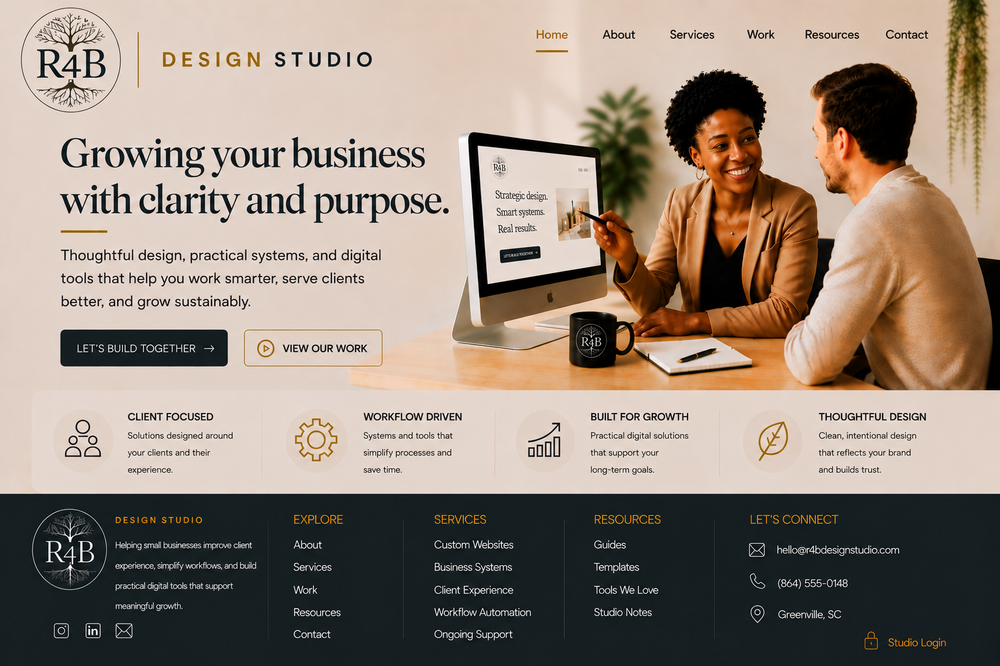
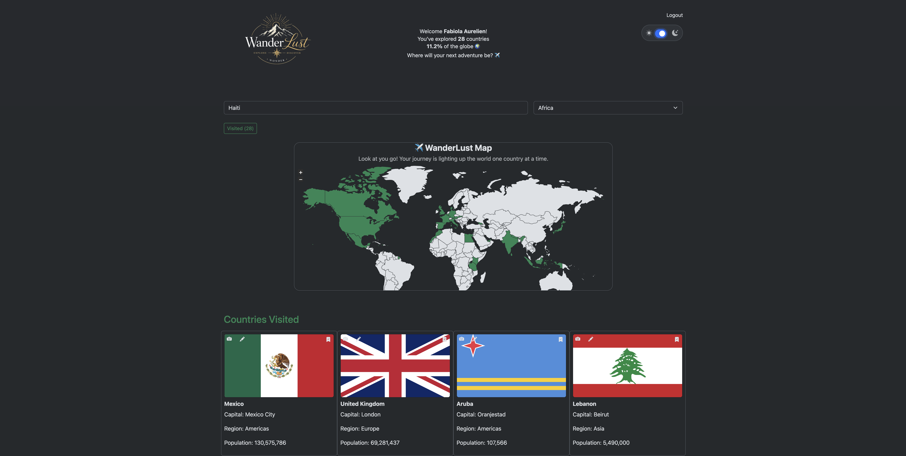
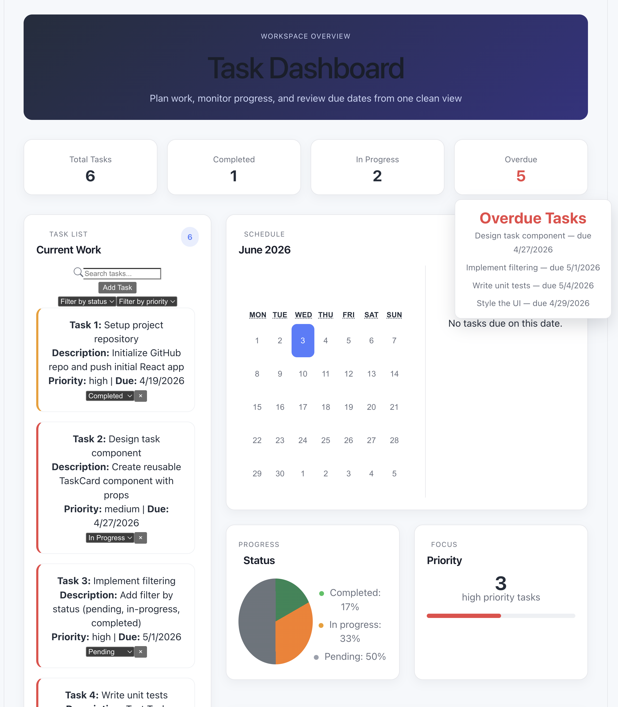
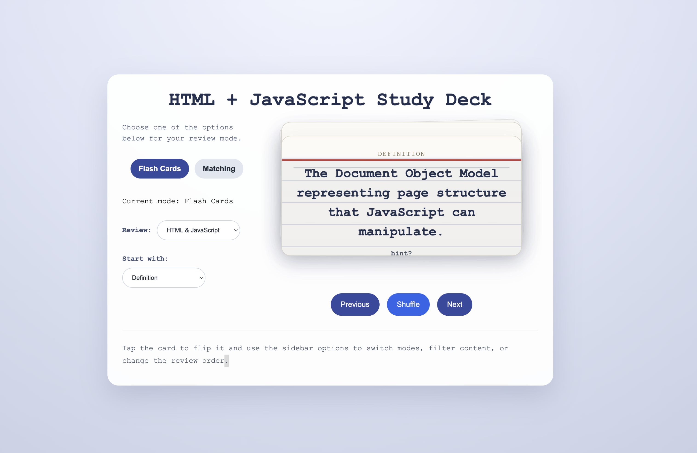

# Hi there, I'm Fabiola Aurelien 👋🏾

### Software Engineer | AI-Native Full-Stack Developer | Mathematician

I began my career as a **Systems Programmer/Analyst**, spent more than **20 years as a mathematics educator**, and have now returned to software engineering to build modern, AI-powered applications.

My background in mathematics and education taught me how to analyze complex systems, solve problems methodically, and communicate technical concepts clearly—skills I now bring to every software project I build.

---

## 🚀 Portfolio

🌐 **Portfolio:** https://capstone-frontend-novc.onrender.com/portfolio

💼 **LinkedIn:** www.linkedin.com/fabiola-aurelien

📧 **Email:** fabiola.aurelien@gmail.com

---

## 🛠 Tech Stack

---

# 💼 Featured Projects

Click any project preview to explore the live demo.

<table>
  <tr>
    <td width="50%" valign="top">
      
      <h3>R4B Design Studio</h3>
      
Full-stack MERN application for secure inquiries, project tracking, task workflows, and business operations.

      
<strong>Tech:</strong> React • TypeScript • Node.js • Express • MongoDB • JWT

    </td>
    <td width="50%" valign="top">
      
      <h3>WanderLust Countries Explorer</h3>
      
Interactive country exploration app with search, filtering, maps, journals, and responsive travel tools.

      
<strong>Tech:</strong> TypeScript • Bootstrap • REST APIs

    </td>
  </tr>
  <tr>
    <td width="50%" valign="top">
      
      <h3>Task Dashboard</h3>
      
Responsive dashboard experience with charts, filtering, task metrics, and clean project visibility.

      
<strong>Tech:</strong> React • Charts • Context API

    </td>
    <td width="50%" valign="top">
      
      <h3>GenAI Flashcard App</h3>
      
AI-assisted study tool that presents learning content through an interactive flashcard experience.

      
<strong>Tech:</strong> React • TypeScript • GenAI

    </td>
  </tr>
  <tr>
    <td width="50%" valign="top">
      
      <h3>Digital Bookshelf</h3>
      
Backend-focused CRUD application demonstrating RESTful routes, server-side rendering, and database-backed workflows.

      
<strong>Tech:</strong> Node.js • Express • EJS • CRUD

    </td>
    <td width="50%" valign="top">
      
      <h3>FuelWise</h3>
      
Collaborative health and fuel-planning app with authentication, protected routes, and API-driven features.

      
<strong>Tech:</strong> React • Node.js • JWT

    </td>
  </tr>
</table>

---

# 🌱 Currently Learning

- Agentic AI Development
- Python
- Retrieval-Augmented Generation (RAG)
- AI Workflows
- MCP
- Production AI Systems

---

# 🎓 Education

### Per Scholas

AI-Native Software Engineering Program

🏆 Recipient of the **Core Values Award**

---

### Spelman College

**Bachelor of Science**

Mathematics (Computer Science Concentration)

---

# 🤝 Let's Connect

🌐 Portfolio

https://capstone-frontend-novc.onrender.com/portfolio

💼 LinkedIn

www.linkedin.com/fabiola-aurelien

📧 Email

fabiola.aurelien@gmail.com

---

> *"Technology continues to evolve. Curiosity, critical thinking, and a commitment to lifelong learning never go out of style."*
